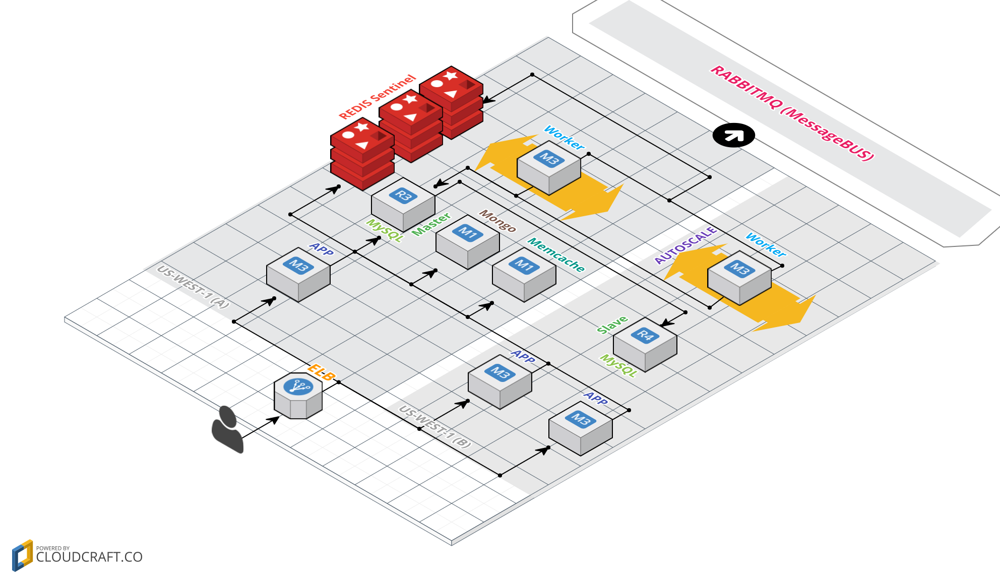

* DevOps **works** closely with a developer/development team/squad **_early on_** to figure out options on many things which development process off-loads to DevOps in the later part of the delivery(and often in haste). Such practice would bring more harmony among teams and more time to soak in requirements, not just from a development perspective, but also with an operational eye.  

**Examples:**

|   	|
|---	|     
| - Unicorn/Puma/RACK/Nginx configuration|
| - Optimal machine configuration|
| - Firewall Rules|
| - Infrastructure role in particular if the machine in question is going to be using something that could be _ACL_-ed eg. S3 access |
| - So on and so forth …….|

##

*   DevOps **owns** certain development artifacts (eg. ruby gems for ruby shops) of any repository that development team has created. Such practice would stop/delay version drift/rot in many operationally critical components/artifacts of development. This point compounds with the previous point.

**Examples:**

|   	|
|---	|
| - who should be chasing versions of MySQL/Redis/.... drivers?  **You or a Developer?** |
| - who should be disseminating information about the new version of ruby and all the goodies it brings?  **You or a Developer?** |
| -    ……. |

##


*   DevOps **handles** server/service/VM/containers' upgrade/maintenance. They will work in tandem with development team(s) to iron out issues it might bring about and around. This agenda has to come from DevOps themselves! This habit will bring us closer to the latest work and the greatest work as open-source moves fast. Why? because the open-source team will always be putting good stuff out there. So, why miss out? Again, the software also rots if we don't stay abreast.

**Examples:**

|   	|
|---	|
| - MongoDB 3.6 is arrived/MySQL 5.8 is here! Do you know what it brings? _what changes need to be done in development codebase eg.ORM to bring in the latest / greatest?_ _what kind of infrastructure change will be required?_
 | - Percona vs MySQL vs MariaDB ? which version of MySQL 5.7 or 5.8 ? _does these question belong to your mind or a developer's mind?_ |
    
##


*    DevOps must extract operational requirements for a development project. We are also responsible to create a prevailing manifest document (eg. DockerFile, Ansible YAML) to complement the requirements.

**Examples:**

`Dockerfile`
```Dockerfile
FROM ruby:2.5.1
LABEL maintainer "Your Name <hello@example.com>"

#Operational Requirements 
RUN apt-get update && \
    apt-get -y --force-yes install nodejs imagemagick && \
    apt-get -y autoremove --purge && \
    apt-get -y autoclean && \
    apt-get -y clean

# This environment needs to set explicitly. 
ENV HOME /root

ENV APPROOT ${HOME}/service

# These are handy variable which influence where gems and their executables are installed.
# Having it outside of application directory allows possiblity of caching it better in docker image layers.
ENV BUNDLE_PATH /var/bundle
ENV GEM_HOME /var/bundle
ENV BUNDLE_BIN /var/bundle/bin

# Although ADD and COPY are similar, COPY is preferred https://docs.docker.com/develop/develop-images/dockerfile_best-practices/#add-or-copy
# Copy the main application.
COPY . $APPROOT

# The WORKDIR instruction sets the working directory for any RUN, CMD, ENTRYPOINT, COPY and ADD instructions that follow it in the Dockerfile
WORKDIR $APPROOT

# configure is our  a preparation script that copies example YAML(among other things) to named yaml so that app could start up among
RUN ./configure

``` 

`Ansible`
```YAML
---
- name: From prebaked AMI to full-blown server
  hosts: localhost
  sudo: True
  roles:
    - role: ec2spin
      ec2spin_appname: example 
      ec2spin_zone: us-west-1b
      ec2spin_ami_tags_name: latest-ami-hvm
      ec2spin_instance_type: t2.medium
      ec2spin_root_volume_size: 12
      ec2spin_appenv: production
      ec2spin_approle: worker
      ec2spin_iam_profile: example-role
      ec2spin_security_groups: [ 'ssh', 'web', 'ntp' ]

- name: Start configuring the spinner
  hosts: spinner
  sudo: True
  vars:
    version: 'ruby-2.5.1'
  roles:
    - role: chruby
      chruby_ruby_version: "{{version}}"

    - role: imagemagick
      imagemagick_version: '7.0.7-33'

    - role: graphicsmagick

    - role: ansicap
      ansicap_application: example
      ansicap_ruby_version: "{{version}}"
      ansicap_environment: production
      ansicap_git_user: git_username

```

##


*   There has to be an infrastructure diagram to back up our automation/work/script to say our job 100% done. The diagram can be as simple as an app-server inside of a certain firewall rule. This could be a RAID10 backed LVM. That diagram might be MongoDB replica set infrastructure. Even the SaaS service/application can be represented this way. It all depends on the needed/required context.

   **Example:**
A fairly sophisticated infra diagram



                 
##

>Note: Whatever tool is used (although [Google Docs](https://docs.google.com/drawings/d/1cch96MmZxZib_-KC6RcXkM2P6L0k_32kl_NwFFvEtv4/edit) is preferred), it needs to follow [Amazon standard icon set](https://aws.amazon.com/architecture/icons/) for infrastructure diagrams. Another tools worth mentioning are [https://cloudcraft.co/](https://cloudcraft.co/) , [https://draw.io](https://draw.io)

           
##


*   DevOps proactively comes up with monitoring data-points as they start to develop/make/maintain pieces of application or infrastructure. Instilling such practices and also encouraging fellow developers along the way to do the same in application viewpoint early on, will tame DevOps to future blunders.

**Examples:**

|   	|
|---	|
|-  Redis instances will need memory checks in addition to Disk/RAM/CPU checks |
|-  MongoDB replicaset needs replication lag check if we are actively using read replicas from the application.|

##

*   DevOps needs to keep track of best practices/production notes for infrastructures/servers / services so as to lessen chances of surprise or to leverage new/improved/fixed things.

**Examples:**
      
|   	|
|---	|
|- Background saving is failing with a fork() error under Linux even if we have a lot of free RAM! **Solution:** `echo 1 > /proc/sys/vm/overcommit_memory`|
|- MongoDB requires a filesystem that supports `fsync()` on directories. For example, HGFS and VirtualBox's shared folders do not support this operation.|
|- AWS _HVM vs PV_ [https://www.opswat.com/blog/aws-2015-why-you-need-switch-pv-hvm](https://www.opswat.com/blog/aws-2015-why-you-need-switch-pv-hvm)|


##


*   Level **UP!** DevOps should foresee the growth and devise the scalability/resilience plan accordingly. It could be as simple as an IOPS optimization in a particular instance or as rewarding as scaling a service to sustain increased traffic or as daunting as infrastructure switch.

##
##

# **Sarcastic Rule of thumb for DevOps Club ;):**
    
*   You go through graphs and stats recorded in monitoring tools as much as you'd check your Facebook/Twitter feed. 

*   You participate in pull-request/code-commit/repository as much as you'd comment/tweet on Facebook/twitter.

*   You over-communicate as much as you'd over-communicate to your Facebook / Twitter followers.

*   For every hour wasted in funny GIFs and entertaining videos on Youtube/Facebook/Twitter, you vow to spend ¼hr in researching something useful to your work.

*   You are fluent in DevOps tools eg.Ansible as much as you are in 'Clash of Clan' tactics.

*   You will be on-call at least ¼ of a month and you are expected to respond as timely as you would reply to your Facebook comments/Twitter replies i.e. 2s to 10s at max ;) and your escalation or remediation for an event is not as sloppy as your Facebook likes/Twitter retweets!!